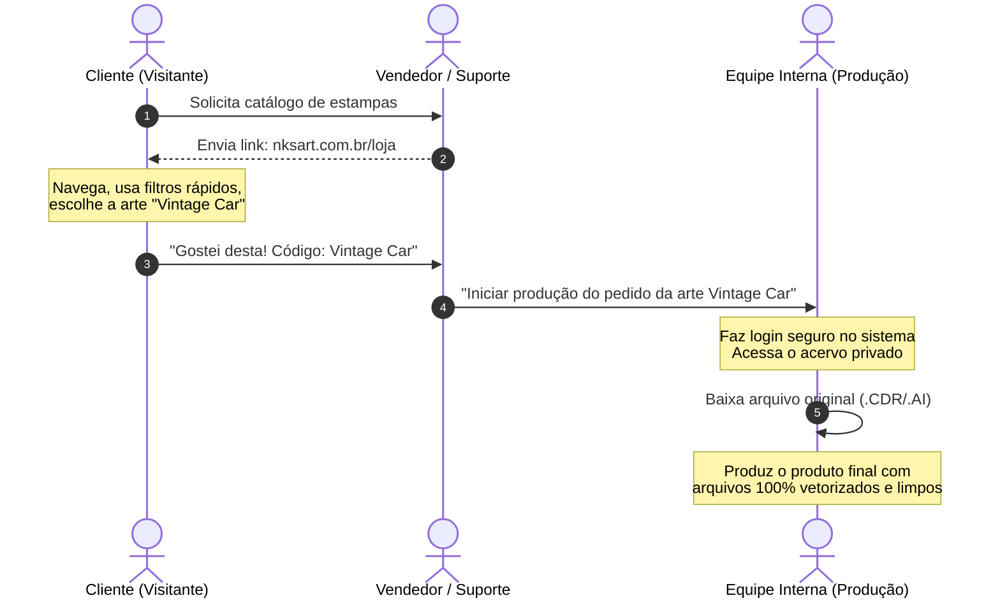

# Apresentação Executiva: NKS Art 🎨
### Catálogo de Vendas & Acervo Digital Privado

Este documento é um guia de apresentação com foco estratégico em **valor de negócio**, **experiência do cliente** e **eficiência operacional** para a empresa. 

Está formatado para leitura direta ou para renderização em slides (padrão Marp / Slidev).

---

## 🧭 Roteiro da Apresentação
1. **Slide 1:** Capa e Visão Geral
2. **Slide 2:** Desafios Operacionais Antigos
3. **Slide 3:** O Catálogo Digital de Vendas (Foco no Cliente)
4. **Slide 4:** O Acervo de Segurança e Backup (Foco no Funcionário)
5. **Slide 5:** Vantagens Estratégicas para a Empresa (Foco no Negócio)
6. **Slide 6:** Escolhas Tecnológicas de Alto Impacto na Experiência (UX & Custos)
7. **Slide 7:** O Fluxo Prático de Operação (Simples e Seguro)
8. **Slide 8:** Roteiro da Demonstração ao Vivo
9. **Slide 9:** Próximos Passos (Transformação em Canal de Receita)
10. **Slide 10:** Encerramento e Visão de Futuro

---

<!-- slide -->

# Slide 1: NKS Art 🎨
### Catálogo de Vendas & Acervo Digital Corporativo

> *Uma plataforma premium que unifica a experiência comercial com o cliente e a segurança dos arquivos de trabalho da equipe de criação.*

* **Objetivo Comercial:** Vitrine interativa de alta conversão para clientes.
* **Objetivo Interno:** Acervo centralizado, seguro e com backup automático de arquivos pesados.
* **Foco da Apresentação:** Retorno sobre investimento, produtividade e proteção de ativos digitais.

---

<!-- slide -->

# Slide 2: Gargalos Operacionais Antigos ⚠️
### O Cenário Sem a Plataforma

* 💬 **Atendimento Comercial Lento:** Vendedores perdiam tempo enviando imagens soltas de estampas e vetores via WhatsApp para os clientes escolherem.
* 💾 **Risco Crítico de Perda de Dados:** Arquivos finais pesados (`.CDR`, `.AI`, `.PDF`, `.OTF`) dispersos em computadores locais de designers, sem backup centralizado estruturado.
* 📦 **Desorganização de Versões:** Equipe de produção constantemente confusa buscando "qual era a versão final aprovada" em HDs externos ou pen-drives.
* 💸 **Custos Ocultos:** Perda de vendas pela demora no atendimento comercial e perda de tempo de retrabalho recriando artes perdidas.

---

<!-- slide -->

# Slide 3: O Catálogo Digital de Vendas 🌟
### Encantando e Facilitando a Vida do Cliente

O NKS Art atua como um canal comercial moderno para a atração e fechamento de novos pedidos:

* 🖼️ **Vitrine Comercial de Luxo:** Previews de alta definição das artes, permitindo ao cliente visualizar a qualidade real do acabamento antes de decidir.
* ⚡ **Navegação Instantânea:** Filtros rápidos por categoria (Ex: Estampas, Vetores, Fontes) e tags facilitam para o cliente encontrar exatamente o que deseja.
* 📱 **Experiência Mobile Premium:** Design adaptável para celulares e tablets. O cliente escolhe as estampas diretamente do celular, com total conforto.
* 📥 **Captação Ativa de Demandas ("Sugerir Arte"):** Canal direto para o cliente enviar sugestões de temas ou artes que ele deseja ver no catálogo, aproximando a empresa de seu público.

---

<!-- slide -->

# Slide 4: O Acervo de Segurança e Backup 🛡️
### Produtividade e Proteção para a Equipe Interna

Para os funcionários de criação e produção, o sistema funciona como um cofre centralizado:

* ☁️ **Backup Automático em Nuvem:** Todos os arquivos de trabalho originais de alta fidelidade ficam guardados de forma segura, imunes a falhas de hardware locais.
* 📁 **Suporte Multi-Formato:** Organização transparente das artes contendo simultaneamente arquivos nativos para CorelDraw (`.CDR`), Adobe Illustrator (`.AI`), `.PDF` e fontes instaláveis (`.OTF`).
* 📊 **Histórico Pessoal ("Meus Downloads"):** O funcionário acompanha tudo o que já baixou, otimizando o fluxo de produção diário.
* 🛡️ **Segurança de Acesso:** Apenas funcionários autenticados (com permissão explícita criada pelo Admin) conseguem baixar os vetores originais.

---

<!-- slide -->

# Slide 5: Vantagens Estratégicas para a Empresa 🚀
### O Impacto Direto no Resultado do Negócio

* ⏱️ **Redução do Ciclo de Venda:** O vendedor simplesmente envia o link do catálogo. O cliente navega de forma autônoma, escolhe as estampas e envia o código. O atendimento leva minutos, não horas.
* 🔒 **Blindagem da Propriedade Intelectual:** Os arquivos originais (que representam milhares de reais investidos em design) estão protegidos contra downloads não autorizados ou vazamentos para concorrentes.
* 📁 **Auditoria e Controle:** O painel administrativo registra em tempo real **quem** baixou, **qual** arte foi baixada e **quando**. Total rastreabilidade dos ativos da empresa.
* 💰 **Retorno de Produtividade:** Menos tempo gasto procurando arquivos, zero perda de arquivos históricos e maior velocidade de entrega no produto final.

---

<!-- slide -->

# Slide 6: Tecnologias que Transformam a Experiência 🛠️
### A Escolha Certa para o Negócio e para o Usuário

Evitamos termos excessivamente técnicos, focando nas tecnologias consagradas que trazem benefício real:

* ⚡ **Next.js & React (Tecnologias do Google/Vercel):**
  * *Por que importa:* É o mesmo motor usado por gigantes como Netflix e TikTok. Garante que o site carregue de forma quase instantânea para o cliente e fique altamente posicionado no Google (SEO), trazendo visitas orgânicas de clientes.
* 🎨 **Tailwind CSS (Visual Premium Moderno):**
  * *Por que importa:* Permite a criação de uma interface limpa, moderna (estilo editorial) que valoriza os produtos e funciona perfeitamente em telas Retina de celulares de ponta.
* ☁️ **Armazenamento de Arquivos em Cloudflare R2:**
  * *Por que importa:* O Cloudflare R2 é uma tecnologia revolucionária com **Zero Egress Fees** (sem taxa de tráfego de download). Em storages tradicionais (como AWS S3), a empresa pagaria uma fatura extra pelo volume de gigabytes baixados pela equipe. Com o R2, baixar arquivos pesados custa **zero reais** em tráfego.

---

<!-- slide -->

# Slide 7: O Fluxo Operacional Simples 🧭

---

<!-- slide -->

# Slide 8: Roteiro da Demonstração ao Vivo 🎬
### Mostrando a Solução em Ação

1. **A Vitrine Comercial (Ponto de Vista do Cliente):**
   * Mostrar a página inicial elegante e responsiva.
   * Demonstrar os filtros de categoria e a velocidade de resposta das buscas.
   * Entrar em uma arte como visitante e mostrar que o download está oculto, com a mensagem: **"Faça login para baixar"**. (Garante que o cliente não tem acesso aos arquivos originais).
2. **O Acervo e Backup (Ponto de Vista do Funcionário):**
   * Realizar o login com uma conta da equipe.
   * Voltar na mesma arte e mostrar que agora os botões de download dos formatos originais (`CDR`, `AI`, `PDF`) estão totalmente disponíveis.
   * Baixar uma das artes originais para mostrar o processo.
   * Acessar a página `/meus-downloads` e exibir o painel de histórico pessoal de backup.

---

<!-- slide -->

# Slide 9: Próximos Passos (Fase 2) 🗺️
### Expandindo e Monetizando o Acervo

* 💳 **Transformação em Canal de Receita (E-commerce):** Integração com meios de pagamento (Mercado Pago ou Stripe) para permitir que clientes de fora da empresa comprem o direito de baixar artes avulsas ou assinem planos mensais.
* 🖼️ **Marca d'Água Dinâmica:** Proteção automática contra prints de clientes mal intencionados nas artes de preview.
* 📧 **Newsletter Comercial Automática:** Lançamentos de novas estampas enviados diretamente para o e-mail dos clientes cadastrados para estimular novas compras.

---

<!-- slide -->

# Slide 10: Conclusão 🏁

O **NKS Art** deixa de ser apenas uma pasta de arquivos e se torna um ativo estratégico da empresa:

* **Para o Cliente:** Um catálogo digital premium, fácil e rápido de escolher.
* **Para a Equipe:** Um acervo centralizado, organizado e protegido por backup.
* **Para o Negócio:** Velocidade de atendimento, proteção de propriedade intelectual e custo de infraestrutura extremamente otimizado (R2).

*Agradecemos a atenção! Estamos abertos a perguntas e sugestões.*
